# Bedtime Story Generator — System Design

An **evaluator–optimizer** pipeline: a storyteller drafts, a panel of judges
critiques against a fixed list of preferences, a final judge aggregates and
gates, and the storyteller revises (bounded) until it passes or the budget runs
out.

## Running

```bash
pip install -r requirements.txt
cp .env.example .env        # then put your own OpenAI key in .env
python main.py              # normal mode: unsafe stories are withheld
python main.py --print-unsafe   # eval mode: print failing stories with a WARNING
python main.py --quiet          # hide the router/judge/reviser trace
```

## Code map

| File | Responsibility |
|---|---|
| `main.py` | CLI I/O, compulsory-safety gate, user feedback turn |
| `pipeline.py` | Orchestration: categorize → generate → evaluate → bounded revise |
| `prompts.py` | Preferences, category templates, all prompt builders |
| `checks.py` | Deterministic (non-LLM) checks — sentence length |
| `llm.py` | OpenAI wrapper (model fixed to gpt-3.5-turbo) |

## Block diagram

```mermaid
flowchart LR
    input([User input]) --> guard{"Input Guard<br/>(temp 0.0)<br/>classify intent:<br/>safe / mild / egregious<br/>+ jailbreak detection"}
    guard -->|egregious| block([Blocked at the door<br/>print safe redirect<br/>storyteller never runs])
    guard -->|"mild → inject sanitize note"| cat
    guard -->|safe| cat
    cat["Categorization<br/>(multi-label, can be &gt;1)<br/>magic · adventure · mystery<br/>educational · family · friends · other"]
    cat --> tmpl["Prompt selection / generation<br/>from the chosen category template(s)"]
    tmpl --> gen["LLM Call — Storyteller<br/>temp ~0.9 (creative)<br/>max 3 generations total"]
    gen --> draft["Story draft"]

    %% Parallel evaluation
    draft --> det["Deterministic checks (Python, no LLM)<br/>sentence length &lt; 25 words<br/>(tokenize on . ? !)"]
    draft --> j1["Judge 1 — positive critique<br/>temp ~0.2"]
    draft --> j2["Judge 2 — negative critique<br/>temp ~0.2"]
    draft --> j3["Judge 3 — general critique<br/>temp ~0.2"]

    det  -->|length report| final
    j1   -->|metric 1| final
    j2   -->|metric 2| final
    j3   -->|metric 3| final

    final["Final Judge<br/>structured output:<br/>• compulsory items → pass/fail<br/>• quality scores<br/>• revision_notes (the nudge)<br/>• passed: bool"]

    %% Bounded revision loop — feedback is injected back into the storyteller prompt
    final -->|"not passed AND revisions &lt; 2<br/>(inject revision_notes)"| gen

    final -->|"passed OR revisions exhausted"| gate{"Compulsory<br/>safety items<br/>all pass?"}

    gate -->|yes| out([Print story])
    gate -->|"no · print_unsafe = false (default)"| supp([Suppress story<br/>print safe fallback message])
    gate -->|"no · print_unsafe = true (eval only)"| warn([Print story<br/>with WARNING header])
```



## Components

| Stage | Role | Notes |
|---|---|---|
| **Input Guard** | Screen the *request* before any generation | classifies intent as safe / mild / egregious and catches jailbreak/prompt-injection. **mild** → sanitize note steers the storyteller; **egregious** → hard block + safe redirect (no generation). Fails *soft* to mild on parse error. Defense-in-depth: judges + gate still run downstream. |
| **Categorization** | Classify the request into one *or more* categories | magic, adventure, mystery, educational, family, friends, other |
| **Prompt selection** | Build the storyteller prompt from the matched category template(s) | combines templates when multiple categories match |
| **Storyteller (LLM Call)** | Generate / revise the story | high temperature (~0.9) for creativity; runs **at most 3 times** (1 draft + ≤2 revisions) |
| **Deterministic checks** | Cheap, reliable, non-LLM validation | sentence length `< 25` words via split on `.?!`. (No bad-word blocklist for now — hard to enumerate.) |
| **Judge 1 / 2 / 3** | Critique the draft against the preference list | J1 = positive critique, J2 = negative critique, **J3 = general (no positive/negative bias)**; low temperature (~0.2) for consistent evaluation; each returns a qualitative summary (metric 1/2/3) |
| **Final Judge** | Aggregate the three metrics + deterministic report | emits **structured output**: per-compulsory-item pass/fail, quality scores, `passed`, and `revision_notes` |
| **Revision loop** | Feed `revision_notes` back into the storyteller | bounded to **≤ 2 revisions**; the nudge is injected into the next prompt |
| **Compulsory safety gate** | Final guard before printing | see flag behavior below |

## Other Decisions

1. **Judge 3 = general judge** — no positive/negative steer; it evaluates the
   draft holistically against the preferences.
2. **`print_unsafe` flag controls the failure path.**
   - Default `False`: if the compulsory items don't pass after the loop, the
     story is **not printed** (safety first); a safe fallback message is shown.
   - Set `True`: the story is printed with a **WARNING** header. This mode
     exists **only for evaluation/debugging**, not normal use.
3. No bad-word blocklist for now.
4. **Final metrics are structured** (per-item pass/fail + quality scores +
   `passed`), while the per-judge metrics stay qualitative to drive good
   revision nudges.

## Preference list

**Compulsory** items (a failure here trips the safety gate):

- Appropriate for ages 5–10
- No violence or scary content
- No bad words or inappropriate content
- No political or religious content
- No controversial content
- Appropriate regardless of:
    - race, gender, or ethnicity
    - religious/spiritual background
    - educational background
    - socioeconomic background
    - cultural background
    - disability background
    - sexual orientation
    - gender identity

**Preferred** (shortfalls can still print, optionally with a WARNING):

- Simple language and grammar; no complex words
- Sentences `< 25` words *(deterministically checked)*
- Fun and engaging; holds a 5–10 year old's attention
- Readable aloud by a 5–10 year old
- In English (any language background)
- Appropriate for any region of the world
