# Bedtime Story Generator

A small agentic system that turns any bedtime-story request into a story that is
**safe and appropriate for ages 5–10**. It is built as a **router** and an**evaluator–optimizer**
loop: a storyteller drafts, a panel of LLM judges critiques against a fixed list
of preferences, a final judge aggregates and gates, and the storyteller revises
(bounded) until the story passes or the budget runs out, with a front-door
safety guard and an interactive feedback loop on top.

> The quality is assessed based on not just the creativity and quality of the story, but also the safety and appropriateness of the story for ages 5 to 10.

---

## Quickstart

```bash
# 1. Install dependencies 
pip install -r requirements.txt

# 2. Add your OpenAI key in the .env file

# 3. Run the main.py file
python main.py
```

### Command-line flags

| Command | Behavior |
|---|---|
| `python main.py` | Normal interactive mode (recommended). |
| `python main.py --quiet` | Hide the live `[guard]`/`[router]`/`[judge]` logs. The JSON trace is still written. |
| `python main.py --print-unsafe` | **Eval/debug only.** Print a story with a `WARNING` header even if it fails a compulsory safety check (default behavior withholds it). |

---

## How it works

```mermaid
flowchart LR
    input([User input]) --> guard{"Input Guard<br/>(temp 0.0)<br/>classify intent:<br/>safe / mild / egregious<br/>+ jailbreak detection"}
    guard -->|egregious| block([Blocked at the door<br/>print safe redirect<br/>storyteller never runs])
    guard -->|"mild → inject sanitize note"| cat
    guard -->|safe| cat
    cat["Categorization<br/>(multi-label, can be &gt;1)<br/>magic · adventure · mystery<br/>educational · family · friends · other"]
    cat --> tmpl["Prompt selection / generation<br/>from the chosen category template(s)"]
    tmpl --> gen["LLM Call — Storyteller<br/>temp ~0.9 (creative)<br/>max 3 generations total"]
    gen --> draft["Story draft"]

    draft --> det["Deterministic checks (Python, no LLM)<br/>sentence length &lt; 25 words<br/>(tokenize on . ? !)"]
    draft --> j1["Judge 1 — positive critique<br/>temp ~0.2"]
    draft --> j2["Judge 2 — negative critique<br/>temp ~0.2"]
    draft --> j3["Judge 3 — general critique<br/>temp ~0.2"]

    det  -->|length report| final
    j1   -->|metric 1| final
    j2   -->|metric 2| final
    j3   -->|metric 3| final

    final["Final Judge<br/>structured output:<br/>• compulsory items → pass/fail<br/>• quality scores<br/>• revision_notes (the nudge)<br/>• passed: bool"]

    final -->|"not passed AND revisions &lt; 2<br/>(inject revision_notes)"| gen
    final -->|"passed OR revisions exhausted"| gate{"Compulsory<br/>safety items<br/>all pass?"}

    gate -->|yes| out([Print story])
    gate -->|"no · print_unsafe = false (default)"| supp([Withhold story<br/>print safe fallback])
    gate -->|"no · print_unsafe = true (eval only)"| warn([Print story<br/>with WARNING header])
```



The pipeline, stage by stage:

1. **Input Guard** — screens the *request* before any generation and classifies
   intent as `safe` / `mild` / `egregious` (also catches jailbreak / prompt
   injection). `mild` requests are sanitized (a steer is injected into the
   storyteller); `egregious` ones are hard-blocked with a friendly redirect and
   the storyteller never runs. Fails *soft* to `mild` on a parse glitch.
2. **Categorization** — multi-label routing into one or more of *magic,
   adventure, mystery, educational, family, friends, other*; each category
   contributes a tailored steering snippet.
3. **Storyteller** — generates the story with a strong system prompt and high
   temperature for creativity.
4. **Evaluation (parallel)** — a deterministic sentence-length check plus three
   LLM judges (positive / negative / general stance) critique the draft against
   the preference list at low temperature.
5. **Final Judge** — aggregates the judges + length report into **structured
   JSON**: per-compulsory-item pass/fail, quality scores, an overall `passed`
   flag, and `revision_notes`.
6. **Bounded revision loop** — if not passing, `revision_notes` are injected back
   into the storyteller; capped at **2 revisions** (3 generations max).
7. **Compulsory safety gate** — before printing, every compulsory item must
   pass. If not, the story is **withheld** (default) or printed with a `WARNING`
   under `--print-unsafe`.
8. **Feedback loop** — the reader can request changes (up to 5), each re-entering
   the pipeline; the whole conversation is saved to a single JSON file.

A deeper write-up of every stage and the preference list lives in
**[DESIGN.md](DESIGN.md)**.

---

## Design choices (and why)

- **Evaluator–optimizer over single-shot.** A judge-driven revise loop reliably
  lifts quality and catches safety issues a single generation would miss.
- **Three judges with different stances** (positive / negative / general). A
  single judge tends to be sycophantic and inflate scores. Forcing one critic to
  hunt for faults counteracts that bias and surfaces real problems and another to capture positive feedback. This is a
  small jury: a known way to reduce self-preference bias.
- **Defense in depth on safety.** An input guard at the door *and* judges *and* a
  final compulsory gate. The guard is not a replacement for the judges, it's a
  cheaper, earlier layer that also catches non-story attacks (jailbreaks).
- **Hybrid guard policy.** `mild` requests are *sanitized* (a war story becomes a
  story about peace) so we stay helpful. Only `egregious` requests are blocked.
- **Fail-closed / fail-soft on purpose.** Unparseable judge output is treated as
  *not passed* (safe). Unparseable guard output → treated as `mild` (sanitize),
  so a parse glitch never refuses a legitimate child.
- **Compulsory vs. preferred preferences.** Safety items are compulsory and can
  withhold a story. Quality items (simple language, short sentences, engaging)
  are preferred and only nudge revisions.
- **Deterministic checks where they're cheaper and more reliable.** Sentence
  length (`< 25` words, split on `.?!`) is verified in plain Python through tokenizer, LLM can miscount. The result is fed to the Final Judge.
- **Structured output for decisions, prose for nudges.** The Final Judge returns
  machine-readable pass/fail + scores (so the gate is reliable), while the
  per-judge critiques stay qualitative (so revisions get rich guidance).
- **Per-call temperature.** Storyteller hot (~0.9) for creativity, and judges/guard
  cold (~0.0–0.2) for consistent evaluation.
- **Full observability.** Every run writes a JSON trace capturing *each
  iteration's* story, all three judges' critiques, the length check, and the
  final verdict, to understand where and why the system improved/can be improved, and for deeper evaluation.
- **MAX_FEEDBACK** is set to 5 to limit the number of feedback rounds, in case of adversarial users who keep requesting changes.
- **MAX_WORDS** is set since children's stories should be of simpler language and easier to understadm, and lenghty sentences can be hard to grasp for them. 

---

## Project structure

| File | Responsibility |
|---|---|
| `main.py` | CLI entry point: I/O, safety gate presentation, feedback loop, trace writing |
| `pipeline.py` | Orchestration: guard → categorize → generate → evaluate → bounded revise |
| `prompts.py` | Preferences, category templates, and every prompt builder |
| `checks.py` | Deterministic (non-LLM) checks — sentence length |
| `llm.py` | Thin OpenAI wrapper (model fixed to `gpt-3.5-turbo`) |
| `reporting.py` | JSON artifacts: per-conversation traces and the eval report |
| `eval_cases.py` | Curated live test suite (routing + safety outcomes) |
| `tests/` | Fast, mocked unit tests (no API key needed) |
| `DESIGN.md` | Full system design + block diagram |

### Key configuration (the knobs)

| Constant | Where | Value | Meaning |
|---|---|---|---|
| `MAX_REVISIONS` | `pipeline.py` | `2` | Internal judge-driven revisions (3 generations max) |
| `MIN_QUALITY` | `pipeline.py` | `3` | Minimum per-dimension quality score to pass |
| `MAX_WORDS` | `checks.py` | `25` | Sentence-length limit (preferred, not compulsory) |
| `MAX_FEEDBACK` | `main.py` | `5` | Max user change requests per conversation |
| Temperatures | `pipeline.py` | `0.9 / 0.2 / 0.0` | Storyteller / judges / router & guard |

---

## Output artifacts

- **`runs/<timestamp>.json`** — one file per conversation, rewritten in place as
  feedback rounds are added. Contains every turn (initial + feedback) and, for
  each, the full per-iteration detail (story, all three judges' critiques, the
  length check, and the final judge's structured verdict).
- **`eval_report.json`** — written by `eval_cases.py`; a summary plus per-case
  rows (guard severity, outcome, iterations, story, full history).


---

## Testing & evaluation

```bash
# Fast unit tests — all LLM calls mocked, no API key required
python -m pytest -q

# Live end-to-end eval (needs an API key); writes eval_report.json
python eval_cases.py                 # all groups
python eval_cases.py gate adversarial  # safety-focused subset
```

The unit tests cover the deterministic logic: the length check, JSON parsing,
the compulsory gate (fail-closed on missing items), the categorizer, the input
guard, and the bounded revision loop (including feedback threading and the
withhold path). The live eval exercises routing and the safety gate against the
real model.

---

## Current Measurement Units:
- The stories should be appropriate for ages 5 to 10.: Compulsory
- The stories should use simple language and grammar, and not use any complex words or grammar.
- The stories should not have sentences that are too long, i.e. should be less than 25 words.
- The stories should not have any violence or scary content.: Compulsory
- The stories should not have any bad words or inappropriate or explicit content.: Compulsory
- The stories should not have any political or religious content. This is a children's story, so it should not be too mature.: Compulsory
- The stories should be fun and engaging, and should be able to hold the attention of a 5 to 10 year old.
- The stories should be able to be read aloud by a 5 to 10 year old.
- The stories should not have any controversial content.: Compulsory
- The stories should be appropriate for any children of any race, gender, or ethnicity.: Compulsory   
- The stories should be appropriate for any children of any religious or spiritual background.: Compulsory  
- The stories should be appropriate for any children of any educational background.: Compulsory
- The stories should be appropriate for any children of any socioeconomic background.: Compulsory
- The stories should be appropriate for any children of any cultural background.: Compulsory
- The stories should be appropriate for any children of any language background, though the story should be in English.
- The stories should be appropriate for any children of any disability background.: Compulsory
- The stories should be appropriate for any children of any sexual orientation background.: Compulsory
- The stories should be appropriate for any children of any gender identity background.: Compulsory
- The stories should be appropriate for any children of any region of the world.

## What I'd have build next (with 2 more hours)

1. Restructuring JSON-outputs to be more readable and easier to understand for analysis and debugging.
2. Add a deterministic bad-word / PII filter to complement the LLM safety judges.
3. Run more experiments to manually evaluate performace of the system, primarily to understand if it is too complex, or could it have performed better or similar without so many constraints. 
Right now I'm implementing based on industry best practices, my own innovation to the design of the system and its prompts, and my own context-specific knowledge.  
   1. measure whether all four metrics and the multi-judge panel actually beat a simpler configuration
   2. tune the four metrics
   3. tune the quality threshold.
4. Would have also preferred to use different models for judges, guard, and storyteller, but the assignment constraint was to use the same model for all.

